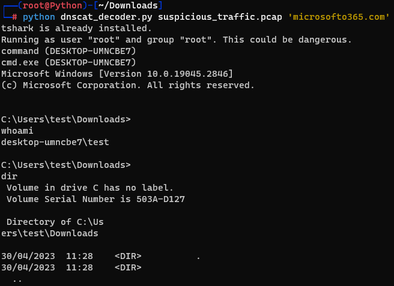

# DNScat-Decoder
TCP Stream Extractor from PCAP using Python

This Python script extracts TCP streams from a Packet Capture (PCAP) file by filtering DNS queries for a specified "bad" domain.
Overview

The script uses the tshark tool to read a PCAP file, extracting DNS query names, and filters packets based on a specified "bad" domain. It decodes relevant packet data and extracts TCP streams associated with the provided domain.
Prerequisites

    Python 3.x
    tshark (Wireshark command-line tool)

Installation

Before using the script, ensure that tshark is installed on your system. If not, the script provides instructions for installation based on the operating system.
Install tshark

Linux Install tshark using apt-get by running:

`sudo apt-get install -y tshark`

Usage
Running the Script

To run the script, execute it from the command line:

    python dnscat_decoder.py path_to_pcap_file bad_domain

    path_to_pcap_file: Path to the input PCAP file.
    bad_domain: Domain used by dnscat. For example: "microsofto365.com"

Example

`python extract_streams.py sample.pcap microsofto365.com`

  

Functionality

    The script extracts TCP streams from the provided PCAP file associated with the specified "bad" domain.
    It decodes packet data and ensures extracted data meets minimum length criteria.
    The extracted TCP streams are displayed on the console and can be further processed as needed within the script.

Contributions

Contributions and improvements to the script are welcome! Feel free to fork the repository and submit pull requests.
License

This script is licensed under the MIT License.
